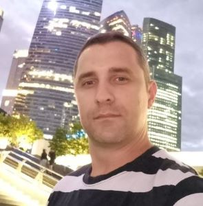

# **SERGEY IVANOV** 

*******



*******

### Junior Frontend Developer 

*******

### *Contact information*: 

* Phone: +375 29 750 08 81
* E-mail: koldyn85@yandex.ru
* Telegram: @Sergey_Ivanow
* [LinkedIn](https://www.linkedin.com/in/%D1%81%D0%B5%D1%80%D0%B3%D0%B5%D0%B9-%D0%B8%D0%B2%D0%B0%D0%BD%D0%BE%D0%B2-a78606210/)
* GitHub: SergeyIvanov85

*******

## **A little bit about myself:**


I am currently an active duty officer in the armed forces and my 20 year career is coming to the end. Despite this, I am only 37 years old and I have a great desire to radically change my profession.
During my military career, I have held various command positions and led a team of more than 1000+ personnel. I have 2 higher educations in the specialty "Scientist in management".

*******

My main immediate goal includes fully mastering my personal theoretical and practical skills, which necessary for qualify me as a high-class FrontEnd developer, further constantly developing myself as a true professional in IT-sphere and eventually getting the job of my dream.

*******

## **My main priorities:**


* self-realization through career growth;
* getting pleasure from the work well done and the result obtained;
* the well-being of my family, the preservation of health and active physical development.

*******

I have 20 years of ongoing service experience, during which I have held various positions, connected with fulfillment of organizational, administrative, financial and managerial functions. For the last 4 years I have been working in the field of international military cooperation. Within its framework I improve my international business communication skills, analytical and communicative abilities, and I try to do it at every turn.
For a year now, I have been studying the basics of the FrontEnd profession and I try to devote all my free time to gaining of new knowledge

*******

## **Why should you pay attention to me?**


* multitasking
* ability to work 24/7
* fluent spoken English
* fast learner
* excellent skill and ability to work in a team
* my credo is search and analysis of information

*******

## **Skills and Proficiency:**


* HTML5, CSS3, JavaScript Basis, PHP Basis
* SCSS, GULP, npm, WordPress
* JQuery Basis
* Git, GitHub
* VS Code, BEM
* Figma, Adobe Photoshop

*******

## Code example:

```
//Создаем таймер для отсчета оставшегося времени акции сервиса:
const timer = (id, deadline) => {
  //Тут добавляем нолик к одноразрядным числам:
  const addZero = (num) => {
    if (num <= 9) {
      return '0' + num;
    } else {
      return num;
    };
  };
  const getTimeRemaining = (endtime) => {
    const t = Date.parse(endtime) - Date.parse(new Date()),
    //количетво секунд, минут, часов которые необходимо отобразить в таймере:
    seconds = Math.floor((t/1000) % 60),
    minutes = Math.floor((t/1000/60) % 60),
    hours = Math.floor((t/(1000*60*60)) % 24),
    days = Math.floor(t / (1000 * 60 * 60 * 24));

    return {
      'total': t,
      'days': days,
      'hours': hours,
      'minutes': minutes,
      'seconds': seconds
    };
  };

  const setClock = (selector, endtime) => {
    const timer = document.querySelector(selector),
    days = timer.querySelector("#days"),
    hours = timer.querySelector("#hours"),
    minutes = timer.querySelector("#minutes"),
    seconds = timer.querySelector("#seconds"),
    timeInterval = setInterval(updateClock, 1000);

    updateClock();

    function updateClock() {
      const t = getTimeRemaining(endtime);

      days.textContent = addZero(t.days);
      hours.textContent = addZero(t.hours);
      minutes.textContent = addZero(t.minutes);
      seconds.textContent = addZero(t.seconds);

      if (t.total <= 0) {
        days.textContent = "00";
        hours.textContent = "00";
        minutes.textContent = "00";
        seconds.textContent = "00";

        clearInterval(timeInterval);
      }
    };
  };
  setClock(id, deadline);
};

export default timer;
```

********

## Work experience:

In the course of my self-study, I completed a number of training projects. Links are located below. Some of them I’m still working on.

* [WindowsFixServise](https://github.com/SergeyIvanov85/Irvas-windows.git) JS, GULP
* [Go Serf landing](https://github.com/SergeyIvanov85/GoSerf-test2.git) HTML, JS, SCSS, GULP
* [WordPress Landing](https://github.com/SergeyIvanov85/timber.git) PHP, JS, CSS

********

## Education:

* 2006 Higher education – Combined arms faculty (the Military Academy of the Republic of Belarus)
* 2013 Higher education – Command and Stuff faculty (the Military Academy of the Republic of Belarus)
* 2020 Course - Organizational and psychological features of the provision of official activities (the National Security Institute)
* 2021 Course -  Geoinformation systems for military purposes (the Military Academy of the Republic of Belarus)
* 2021 Course -  English Intermediate (B1+) (Minsk State Linguistic University)
* 2021 Course -  English Upper Intermediate (B2) (Minsk State Linguistic University)
* 2022 Course -  English language course [STANAG 6001 Level 3](http://www.stanag6001.com/languages/) (the Military Academy of the Republic of Belarus)

********

## Languages:

* English – Upper-intermediate/ Advanced
* Russian – Native


I use English on a daily basis to carry out my job duties. The main tasks include direct communication with partners, as well as official correspondence and real-time interpretation of negotiations, so I’m able to keep conversation going.


